.. index:: configuration
.. _SysAdm™ Client:

|sysadm| Client
***************

Beginning with |trueos| 11, most of the system management utilities that
were previously available in the |pcbsd| Control Panel have been
rewritten to use the |sysadm| API. This API is designed to make it easy
to manage any FreeBSD or |trueos| desktop or server system over a secure
connection from any operating system that has the |sysadm| application
installed. |sysadm| is built into |trueos|, but downloadable packages
for other operating systems are available from the
`SysAdm Website <https://sysadm.us/>`_.

.. note:: By default, |sysadm| does not allow for remote access to the
   system. Please review the |sysadm| server handbook for instructions
   on initializing the remote access elements of |sysadm|.

A number of utilities have been removed from Control Panel as they are
now available in the |sysadm| client:

**Application Management**

* :ref:`AppCafe®`

* :ref:`Update Manager`

**SysAdm Server Settings**

* :ref:`Managing Remote Connections`

**System Management**

* :ref:`Boot Environment Manager`

* :ref:`Firewall Manager`

* :ref:`Service Manager`

* :ref:`Task Manager`

* :ref:`User Manager`

**Utilities**

* :ref:`Life Preserver`

The rest of this client guide provides an overview of the |sysadm|
client and all of its functionality, beginning with |appcafe|.

.. note:: Instructions for using the API in your own scripts can be
   found in the `SysAdm™ API Reference Guide <http://api.sysadm.us/>`_.

.. index:: software, configuration, sysadm
.. _AppCafe®:

|appcafe|
=========

|appcafe| provides a graphical interface for installing and managing
FreeBSD packages, which are pre-built applications that have been tested
for FreeBSD-based operating systems. This interface displays extra
meta-data, such as application screenshots and lists of similar
applications.

The rest of this section describes how to manage software using |appcafe|.

.. index:: AppCafe®
.. _Finding Software:

Finding Software
----------------

The "Browse" tab, shown in
:numref:`Figure %s <appcafe1>`, is used to find
available software. 

.. _appcafe1:

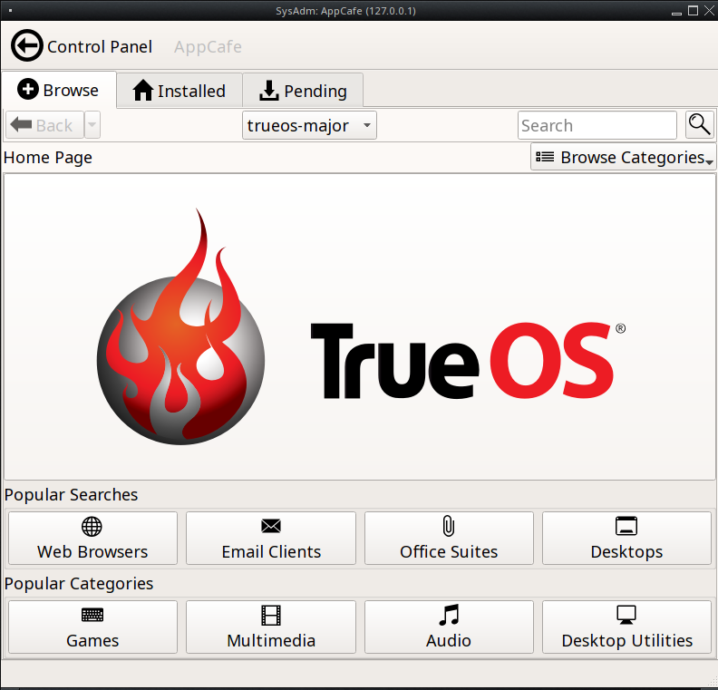

   : Browse Tab of |appcafe|

This screen contains these options:

**Back:** Click this button to leave a category or search result and
return to the previous screen.

**Repository drop-down menu:** Use this drop-down menu to select the
repository to search or browse. The selections include: "major"
(applications available for installation), "base" (applications that
are part of the base operating system), and "local" (all installed
applications).

**Search:** To see if an application is available, enter its name and
click the "binoculars" icon. Alternately, enter a description. For
example, a search for "browser" will display software with "browser"
in the name as well as applications which provide browser
functionality, such as Firefox. 

**Browse Categories:** This drop-down menu lists the available software
categories. If you select a category, it will only display or show
search results from that category.

**Popular Searches and Popular Categories:** The buttons in these
sections can be used to quickly find applications which are recommended
by other |trueos| users. Click a button to get a curated list of
applications that match the button's description.

Displayed applications will be listed in alphabetical order.
Applications which are already installed and which are not required by
other applications have a trashcan icon which can be clicked to
uninstall that application. Applications which are not installed have a
down arrow icon which can be clicked to install that application.

Click the name of an application to view more information about the
application. In the example shown in :numref:`Figure %s <appcafe2>`, the
user has clicked :guilabel:`Firefox` on a system that has Firefox
installed.

.. note:: |appcafe| provides a graphical front-end for displaying the
   contents of the package database. Since installed applications
   provide more information to the package database, some fields will
   be empty, depending upon the  selected repository. For example, the
   package message will only be displayed when the "local" repository
   is selected, the package is actually installed, and the package
   provides a message during installation.

.. _appcafe2:

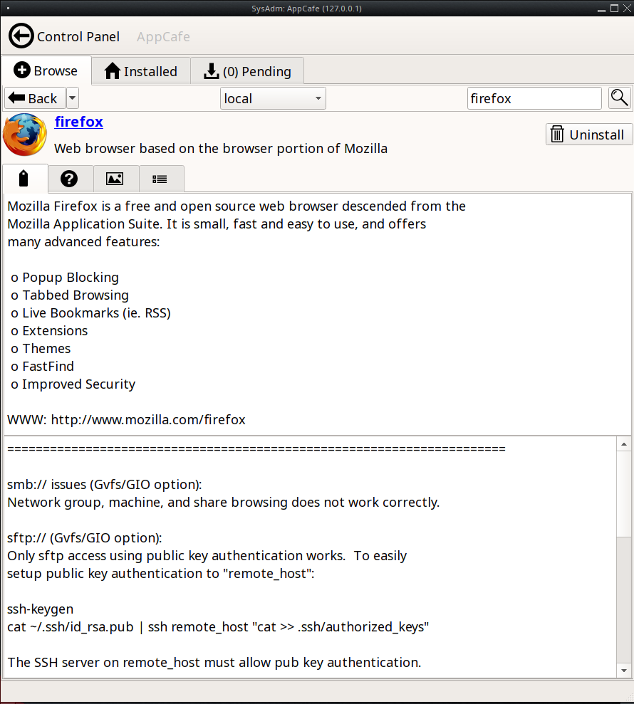

   : |appcafe| - Viewing the Details of an Installed Application

As seen in this example, the information for an application includes
the application's icon, name, and description. Click the application's
name to open the website for the application in the default web
browser. If the application is installed, there will be an
:guilabel:`Uninstall` button.

Beneath this area are 4 tabs. The first tab on the left contains two
panes. The first (middle) pane displays the package description. The
second (bottom) pane displays the message that appears when the
package is installed.
  
An example of the "?" tab is shown in 
:numref:`Figure %s <appcafe3>`

.. _appcafe3:

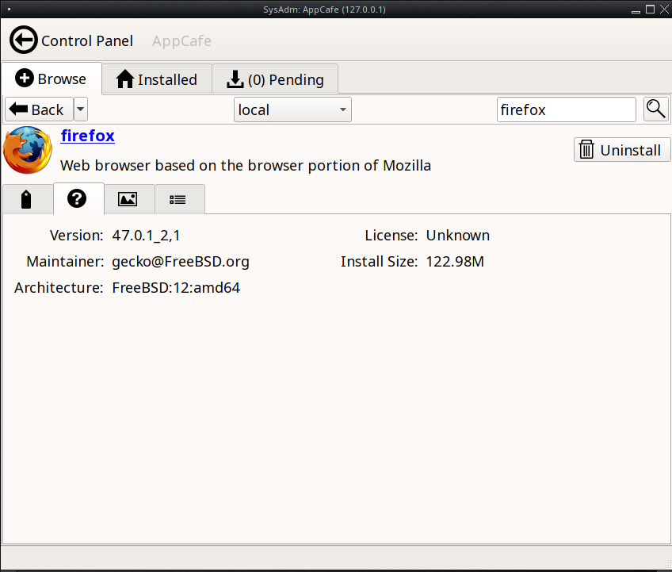

   : |appcafe| - More Application Details

This tab displays a variety of information:

* Software version.

* Email address for the maintainer of the FreeBSD port the package is
  built from.

* The application's architecture. This will indicate the FreeBSD version
  and whether or not the application is 32-bit or 64-bit. Note |trueos|
  can run both 32 and 64-bit applications.

* The application's license.

* The application's installation size.

* The application's download size.

If the package includes screenshots of the application, you can click
the next tab, which has an image icon, to view and scroll through the
screenshots. An example is shown in
:numref:`Figure %s <appcafe4>`

.. _appcafe4:

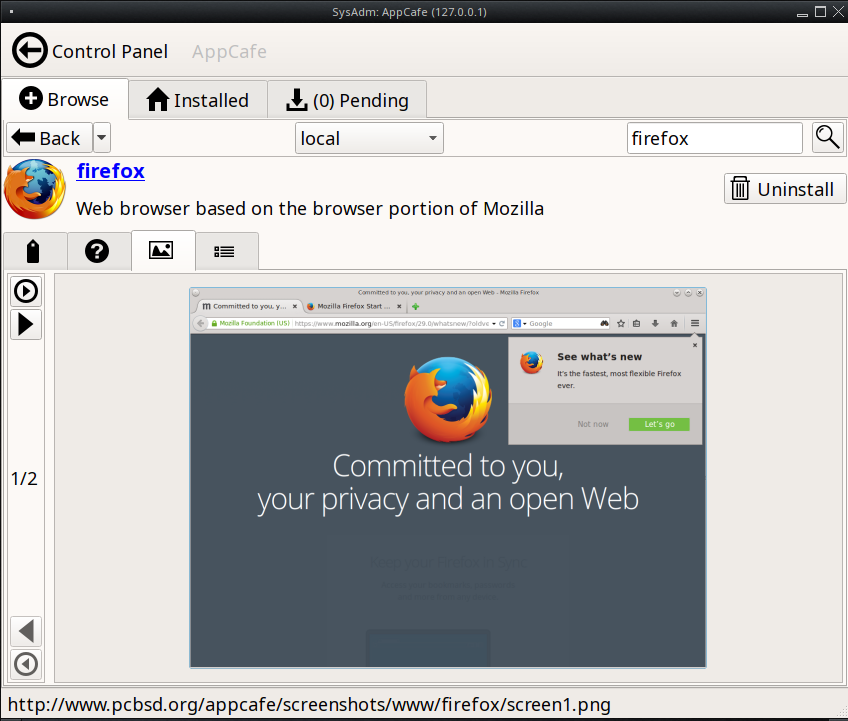

   : |appcafe| - Viewing the Application's Screenshots

An example of the last tab, which has a list icon, is shown in
:numref:`Figure %s <appcafe5>`.

.. _appcafe5:

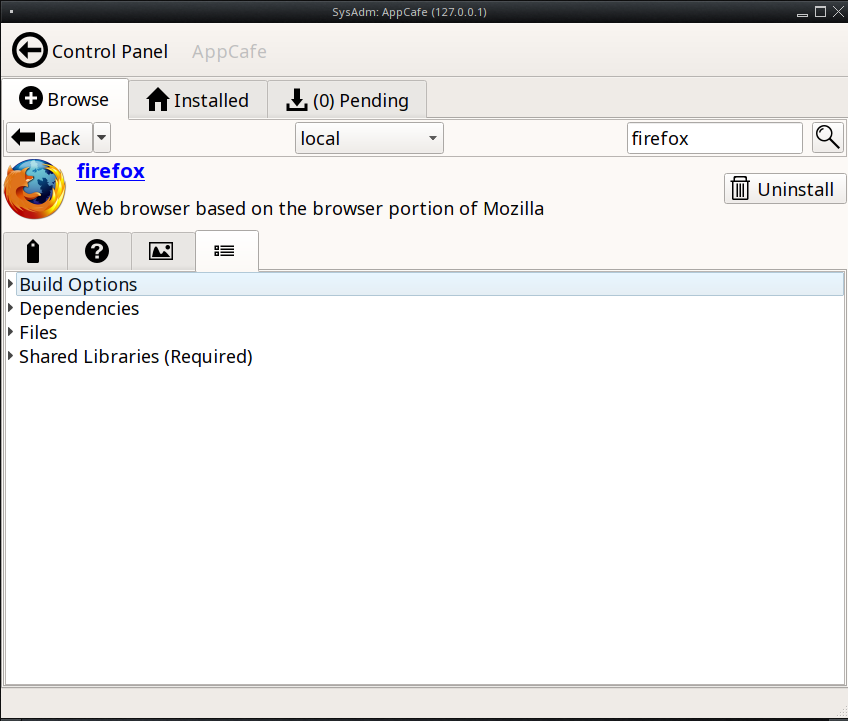

   : |appcafe| - Viewing the Details of an Installed Application

This tab contains the following information. Click the right arrow next
to an entry to expand its information and the down arrow to collapse
the information.

* **Build Options:** shows the values of the make options that the
  package was built with.

* **Dependencies:** lists the dependent packages that this
  application requires to be installed.

* **Required By:** indicates the names of any other packages that
  require this software to be installed.

* **Shared Libraries (Required):** lists the names of the libraries
  that this application requires.

.. _Manage Installed Software:

Managing Installed Software
---------------------------

To view and manage the applications which are installed on the system,
click the :guilabel:`Installed` tab.  An example is seen in
:numref:`Figure %s <appcafe6>`.

.. _appcafe6:

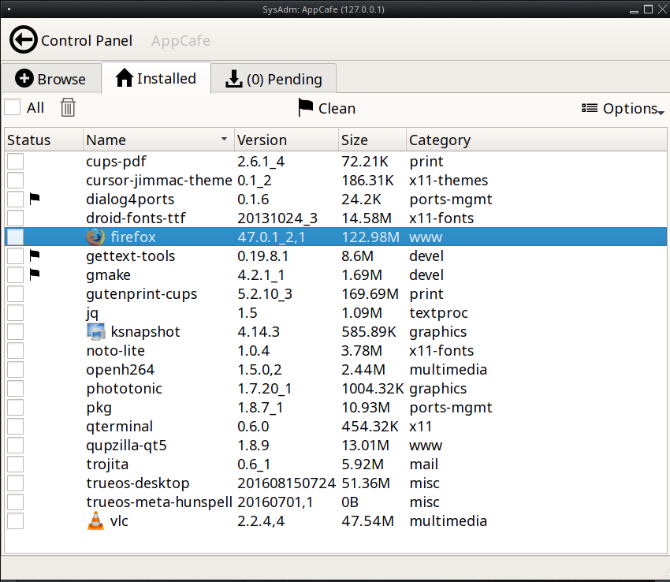

   : |appcafe| - Installed Tab

This screen offers several actions:

* **All:** check this box to select all installed applications or
  uncheck it to deselect all installed applications.

* **Uninstall:** click the garbage can icon to uninstall the selected
  applications.

* **Clean:** this operation deletes any orphaned packages for the
  selected applications. An orphaned package is one that is not
  required by any other applications. It will have a black flag icon
  (the same as the :guilabel:`Clean` icon) in its :guilabel:`Status`
  column.

This screen also provides an :guilabel:`Options` drop-down menu which
allows you to select or deselect a number of options:

* **View All Packages:** by default, the installed tab only shows the
  packages you installed. Check this box to also see the packages
  included with the operating system. Packages which have a black banner
  icon under their :guilabel:`Status` column have dependent packages.
  This means if you delete a package with a black banner, you will
  also delete their dependent packages so you are not left with orphaned
  packages.

* **View Advanced Options:** if you check this box, two extra icons, a
  lock and an unlock icon, will be added to the right of the trash
  icon. If you select an application and click the lock icon, a lock
  lock icon will be added to its :guilabel:`Status` column. As long as
  an application is locked, it will not be updated by
  :ref:`Update Manager`. This is useful if you need to remain with a
  certain version of an application. In order to upgrade an
  application, you will need to first select it and click the unlock
  icon.

* **Auto-clean packages:** if you check this box, the :guilabel:`Clean`
  icon will disappear as you no longer need to manually clean orphans.
  Instead, whenever you uninstall an application, any orphans will also
  automatically uninstall.

In the example shown in 
:numref:`Figure %s <appcafe7>`,
the user has checked all available options. In this example,
:guilabel:`aalib` has dependencies (banner icon), :guilabel:`alsa-lib`
has been locked, and :guilabel:`alsa-plugins` is an orphan (flag icon).

.. _appcafe7:

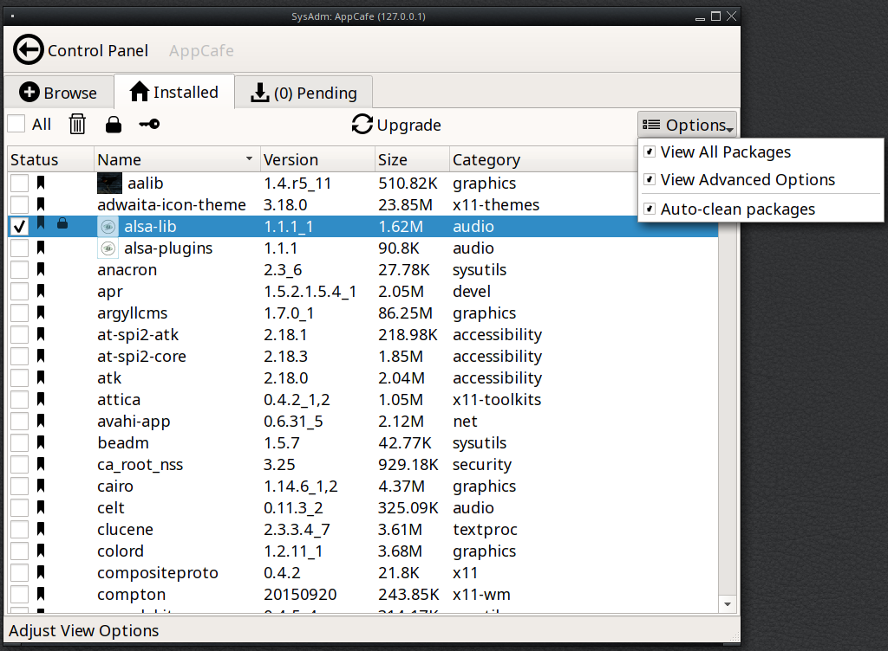

   : |appcafe| - Viewing Applications With All Options Checked

If you install or uninstall any software, click the :guilabel:`Pending`
tab to view the details of the operation. In the example shown in
:numref:`Figure %s <appcafe8>`,
this system has had a package install and a package locking operation,
and each has a dated entry in the process log. Highlight an entry and
check the :guilabel:`View Process Log` box to review the log for the
operation.

.. _appcafe8:

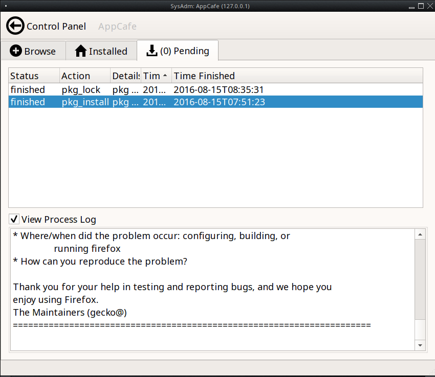

   : |appcafe| - Viewing the Status of the Operation

.. index:: updates
.. _Update Manager:

Update Manager
==============

Update Manager provides a graphical interface for keeping the |trueos|
operating system and its installed applications up-to-date.

The |trueos| update mechanism provides several safeguards to ensure
updating the operating system or its software is a low-risk operation.
The following steps occur automatically during an update:

* The update automatically creates a snapshot (copy) of the current
  operating system, known as a boot environment (BE), and mounts the
  snapshot in the background. All of the updates then occur in the
  snapshot. This means you can safely continue to use your system while
  it is updating, as no changes are being made to the running version of
  the operating system or any of the applications currently in use.
  Instead, all changes are being made to the mounted copy. See
  :ref:`Boot Environment Manager` for more information related to boot
  environments.

.. note:: If the system is getting low on disk space and there is not
   enough space to create a new BE, the update will fail with a message
   indicating there is not enough space to perform the update.

* While the update is occurring, and until you reboot after the update,
  you will be unable to use |appcafe| to manage software. This is a
  safety measure to prevent package conflicts. Also, the system shutdown
  and restart buttons will be greyed out until the update is complete
  and the system is ready to reboot. Should a power failure occur in the
  middle of an update, the system will reboot into the current boot
  environment, returning the system to the point before the upgrade
  started. Simply restart the update to continue the update process.

* Once the update is complete, the new boot environment or updated
  snapshot is added as the first entry in the boot menu. It is then
  activated so the system will boot into it, unless you pause the boot
  menu and specify otherwise. A pop-up message will indicate a reboot is
  required. You can either finish what you are doing now and reboot into
  the upgraded snapshot, or ask the system to remind you again later.
  To configure the time of the next warning, click the
  :guilabel:`Next Reminder` drop-down menu where you can select 1, 5,
  12, or 24 hours, 30 minutes, or never (for this login session).
  Note the system will not apply any more updates, allow you to start
  another manual update, or install additional software using |appcafe|
  until you reboot.

* The default ZFS layout used by |trueos| ensures when new boot
  environments are created, the :file:`/usr/local/`, :file:`/usr/home/`,
  :file:`/usr/ports/`, :file:`/usr/src/` and :file:`/var/` directories
  remain untouched. This way, if you decide to roll back to a previous
  boot environment, you will not lose data in your home directories, any
  installed applications, or downloaded source files or ports. However,
  you will return the system to its previous state, before the update
  was applied.

.. _Managing Updates:

Managing Updates
----------------

An example of the :guilabel:`Updates` tab is shown in
:numref:`Figure %s <update1>`.

.. _update1:

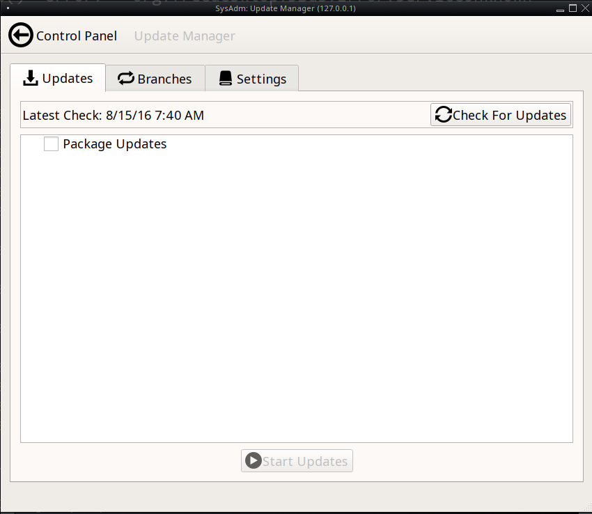

   : Managing Updates

In this example, updates are available for installed packages. If a
security update is available, it will be listed as such. Apply the
available updates by clicking the box next to each entry you want to
update, which activates the :guilabel:`Start Updates` button. Once the
button is pressed, it will change to :guilabel:`Stop Updates` so you can
stop the update if necessary. As the selected updates are applied, the
progress of the updates will be displayed.

.. warning:: Update Manager will update **all** installed software. If
   you have placed a lock on a package using :command:`pkg` or
   |appcafe|, Update Manager will fail and will generate a message
   indicating the failure is due to a locked package. If an application
   is locked and cannot be updated, the software will need to be
   manually updated instead using :command:`pkg`.

Once the update is complete, Update Manager will provide a message
indicating a reboot is required. When ready, save your work and manually
reboot into the new boot environment containing the applied updates.

The :guilabel:`Latest Check` field indicates the date and time the
system last checked for updates. To manually check for updates, click
:guilabel:`Check for Updates`.

The :guilabel:`Settings` tab is shown in
:numref:`Figure %s <update4>`.

.. _update4:

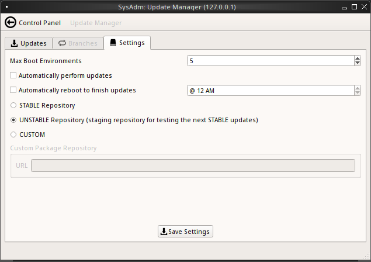

   : Update Manager Settings Tab

This tab contains several configurable options:

* **Max Boot Environments:** |trueos| automatically creates a boot
  environment before updating any software, the operating system, or
  applying a system update. Once the configured maximum number of boot
  environments is reached, |trueos| will automatically delete the oldest
  automatically created boot environment. However, it will not delete
  any boot environments created manually using the
  :ref:`Boot Environment Manager`. The default number of boot
  environments is *5*, with an allowable range from *1* to *10*.

* **Automatically perform updates:** When checked, the automatic
  updater keeps the system and packages up-to-date. An update has
  completed when the pop-up menu indicates a reboot is needed to
  complete the update process. If
  :guilabel:`Automatically perform updates` is unchecked, an update will
  only occur at the user's discretion. By default, updates will **not**
  be automatic. |trueos| uses an automated updater which checks for
  updates no more than once per day, 20 minutes after a reboot and then
  every 24 hours.

* **Automatically reboot to finish updates:** This selection initiates
  a system reboot at a designated time in order to finish the update
  process. By default, this selection is **unchecked**. Once checked,
  the reboot time can be configured to a specific hour of the day.
  Highlight the hour number and either type a new hour, or use the
  :guilabel:`arrows` to increase or decrease the hour. Highlight
  :guilabel:`AM/PM` to adjust this value. 

* **Repositories:** |trueos| uses two repositories for updates,
  :guilabel:`STABLE` and :guilabel:`UNSTABLE`. :guilabel:`STABLE` will
  only update to formally released updates. :guilabel:`UNSTABLE` is the
  testing location for upcoming updates. It is recommended only for
  advanced users or those who wish to help test |trueos| and |lumina|.

  To use a custom package repository for updates, check
  :guilabel:`CUSTOM`. This will activate the :guilabel:`URL` field so
  the user can input the URL to the custom repository.

Once all options are configured to their desired settings, click
:guilabel:`Save Settings`.

.. index:: updates
.. _Upgrading from PCBSD 10.x to TrueOS:

Upgrading from |pcbsd| 10.x to |trueos|
---------------------------------------

.. warning:: If any user account uses PersonaCrypt, please be sure to
   save any encryption keys to a safe place (e.g. a thumb drive) before
   beginning the upgrade process. Loss of encryption keys may result in
   being unable to import the home directory after the upgrade is
   complete.

If the system is using |pcbsd| 10.x, the option to update to |trueos|
will not appear in the Control Panel version of Update Manager. This is
because a new installation is required in order to migrate to |trueos|.
However, the |trueos| installer allows the user to keep all their
existing data and home directories, as it provides the ability to
install |trueos| into a new boot environment. In other words, the new
operating system and updated applications are installed while the ZFS
pool and any existing boot environments are preserved. Since the new
install is in a boot environment, the option to boot back into the
previous |pcbsd| installation will remain.

.. note:: This option overwrites the contents of :file:`/etc`. If any
   custom configurations exist, save them to a backup or the home
   directory first. Alternately, use the :ref:`Boot Environment Manager`
   post-installation to mount the previous |pcbsd| boot environment to
   copy over any configuration files which may not have been backed up.

To perform the installation to a new boot environment, start the
|trueos| installation as described in the
`TrueOS® Handbook <https://www.trueos.org/handbook/trueos.html>`_. In
the `System Selection Screen <https://www.trueos.org/handbook/install.html#system-selection-screen>`_,
choose to install either a desktop or a server. Press :guilabel:`Next`
to view the :guilabel:`Disk Selection` screen, shown in
:numref:`Figure %s <upgrade1>`.

.. _upgrade1:

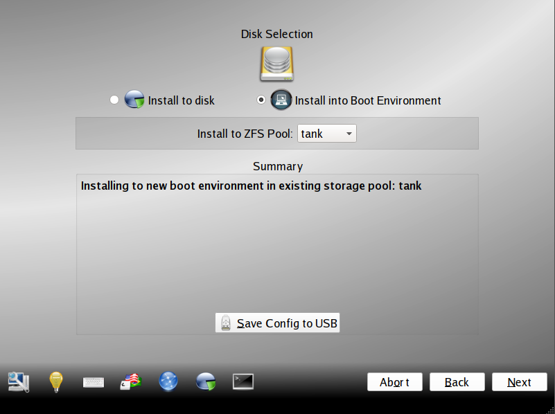

   : Disk Selection

|trueos| automatically detects if the drive has an existing boot
environment, filling in the data as necessary. If no boot environments
are detected, :guilabel:`Install into Boot Environment` will be greyed
out. To upgrade, select :guilabel:`Install into Boot Environment` and
choose which existing pool to install into from the drop-down menu. In
the :ref:`Disk Selection Screen <upgrade1>`, the user is installing into
the existing **tank** pool. Press :guilabel:`Next` when ready.

.. warning:: Be sure :guilabel:`Install into Boot Environment` is
   checked before proceeding, or data can be lost.

A pop-up will appear, asking to start the default Full-Disk
installation. Click :guilabel:`Yes` to start the installation.

Once the installation is complete, reboot the system and remove the
installation media. The post-installation screens will run as described
in the
`Post Installation Configuration and Installation Troubleshooting <https://www.trueos.org/handbook/postinstall.html>`_
section of the |trueos| Handbook to configure the new installation.

.. note:: During the
   `Create a User Screen <https://www.trueos.org/handbook/postinstall.html#create-a-user-screen>`_
   process, recreate the primary user account using the same name user
   name and user id (UID) from the previous |pcbsd| system. This allows
   |trueos| to associate the existing home directory with that user.
   Once logged in, use :ref:`User Manager` to recreate any other user
   accounts or to reassociate any PersonaCrypt accounts.

.. index:: sysadm, configuration
.. _Managing Remote Connections:

Managing Remote Connections
===========================

Use the |sysadm| GUI to create and manage an SSL key or certificate
bundle, as seen in :numref:`Figure %s <ssl1>`.

.. _ssl1:

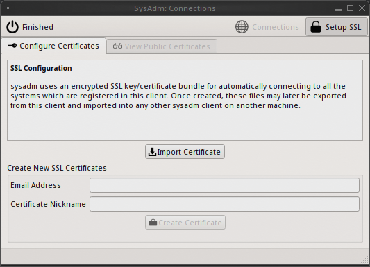
   
   : Configure Certificates tab of the Setup SSL menu

This window is accessible by clicking the |sysadm| tray icon, then
:guilabel:`Manage Connections`. Press :guilabel:`Import Certificate`
to open a window to choose an :file:`.export` file. Type a valid Email
Address and memorable nickname for :guilabel:`Create Certificate` to
activate. Click :guilabel:`Create Certificate` to open the
:guilabel:`SSL Passphrase` window. This window requests a password, then
requests the password to be re-entered for confirmation. Enter the
second password and click :guilabel:`Ok` to create the certificate.
Upon certificate creation, the user can navigate to
:menuselection:`Setup SSL --> View Public Certificates` to view and
export a public key for a Server or Bridge Certificate, seen in
:numref:`Figure %s <ssl2>`.

.. _ssl2:

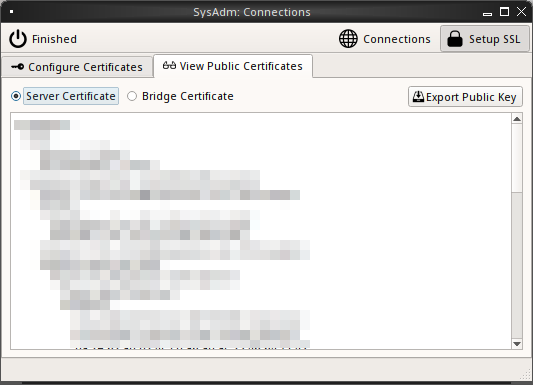
   
   : View Public Certificates tab of the Setup SSL menu

Once a certificate is created, the :guilabel:`Connections` Tab, seen in
:numref:`Figure %s <ssl3>`, immediately opens.

.. _ssl3:

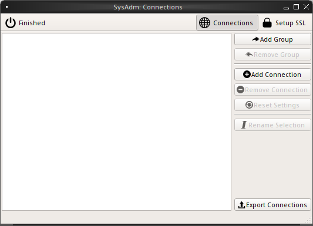
   
   : |sysadm| SSL Connections Tab

:guilabel:`Connections` aids the user in creating and managing
secure connections. A column on the left side of the window contains all
management options, described in :numref:`Table %s <conops>`

.. _conops:

.. table:: : SSL Connection tab Options

   +--------------------+---------------------------------------------------+
   | Option             | Description                                       |
   +====================+===================================================+
   | Add Group          | Creates an overarching group for bundling         |
   |                    | connections.                                      |
   +--------------------+---------------------------------------------------+
   | Remove Group       | Deletes a created group.                          |
   +--------------------+---------------------------------------------------+
   | Add Connection     | Opens windows to nickname and configure a         |
   |                    | new server connection or bridge relay.            |
   +--------------------+---------------------------------------------------+
   | Remove Connection  | Deletes a single created connection.              |
   +--------------------+---------------------------------------------------+
   | Reset Settings     | Opens the connection setup window to              |
   |                    | reconfigure a created connection.                 |
   +--------------------+---------------------------------------------------+
   | Rename Selection   | Renames a created group or connection.            |
   +--------------------+---------------------------------------------------+
   | Export Connections | Exports the SysAdm settings to a default          |
   |                    | location:                                         |
   |                    | :file:`/usr/home/<username>/sysadm_client.export` |
   +--------------------+---------------------------------------------------+

Creating groups or connections adds their respective nicknames to the
large box to the left of the options column. Highlight an existing group
to create new subgroups with :guilabel:`Add Group`. Groups and
connections can be organized by clicking the desired entry and dragging
it to the desired location. The entries in this area update |sysadm| in
real time, immediately displaying any groups or connections within the
tray icon area.

When creating a new connection with :guilabel:`Add Connection`, a pop-up
window requests a nickname for the new connection. A configuration
screen, seen in :numref:`Figure %s <addconconf>`

.. _addconconf:

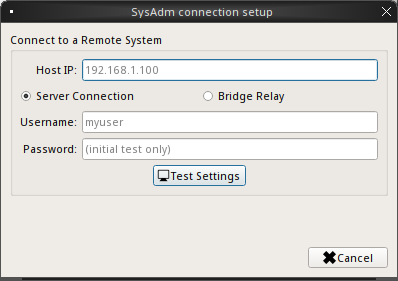

   : |sysadm| new connection configuration

The first element to configuring a new connection is to input a Host IP
address. Then, choose the connection type: :guilabel:`Server Connection`
or :guilabel:`Bridge Relay`. Type a valid Username and Password, then
click :guilabel:`Test Settings` to test the settings. Upon a successful
connection test, the settings area greys out and the only option is to
click :guilabel:`Finished`.

.. index:: sysadm, boot environments, ZFS
.. _Boot Environment Manager:

Boot Environment Manager
========================

|trueos| supports a feature of ZFS known as multiple boot environments
(BEs). With multiple BEs, the process of updating software becomes a
low-risk operation as the updates are applied to a different boot
environment. If needed, there is an option to reboot into a backup boot
environment. Other examples of using boot environments include:

* When making software changes, it is possible to take a snapshot of the
  boot environment at any stage during the modifications. In the event
  of undesirable results, the user can roll back to a previous BE by
  activating a different BE according to the instructions under the
  :ref:`TrueOS Boot Menu image <install1(1)>`.

* Save multiple boot environments on the system and perform various
  updates on each of them as needed. Install, test, and update different
  software packages on each.

* Mount a boot environment in order to :command:`chroot` into the mount
  point and update specific packages on the mounted environment.

* Move a boot environment to another machine, physical or virtual, in
  order to check hardware support.

.. note:: For boot environments to work properly, **do not** delete the
   default ZFS mount points during installation. The default ZFS layout
   ensures when boot environments are created, the :file:`/usr/local/`,
   :file:`/usr/home/`, :file:`/usr/ports/`, :file:`/usr/src/` and
   :file:`/var/` directories remain untouched. This method allows
   rolling back to a previous boot environment while preserving data in
   your home directories, any installed applications, or downloaded
   source files or ports. During installation, you can add more mount
   points, but avoid deleting the default points.

To ensure the files the operating system needs are included when the
system boots, all boot environments on a |trueos| system include
:file:`/usr`, :file:`/usr/local`, and :file:`/var`. User-specific data
is **not** included in the boot environment. This means
:file:`/usr/home`, :file:`/usr/jails`, :file:`/var/log`,
:file:`/var/tmp`, and :file:`/var/audit` will not change, regardless of
which boot environment is selected at system boot.

To view, manage, and create boot environments using the |sysadm|
graphical client, go to
:menuselection:`Local System --> System Management --> Boot Environment Manager`.
In the example shown in :numref:`Figure %s <be1>`, there is a
highlighted entry named *initial* which represents the original |trueos|
installation.

.. _be1:

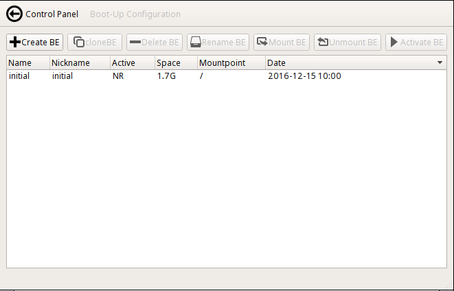

   : Managing Boot Environments

.. tip:: An automatically generated boot environment is generally named
   with a version and date stamp. It is recommended to note the desired
   date when choosing to activate a different BE.

Each entry contains the same information, displayed here in
:numref:`Table %s <mbetable1>`:

.. _mbetable1:

.. table:: : Individual Boot Environment information

   +------------+---------------------------------------------------------+
   | Column     | Description                                             |
   +============+=========================================================+
   | Name       | The name of the boot entry as it appears in the boot    |
   |            | menu.                                                   |
   +------------+---------------------------------------------------------+
   | Nickname   | A description which can be different from the           |
   |            | :guilabel:`Name`.                                       |
   +------------+---------------------------------------------------------+
   | Active     | The possible values of this field are *R* (active on    |
   |            | reboot), *N* (active now), *NR* (active now and on      |
   |            | reboot), or *-* (inactive). In this                     |
   |            | :ref:`example <be1>`, the system booted from            |
   |            | *12.0-CURRENT-up-20161215_101908* and also uses this BE |
   |            | for the next boot.                                      |
   +------------+---------------------------------------------------------+
   | Space      | The size of the boot environment.                       |
   +------------+---------------------------------------------------------+
   | Mountpoint | Indicates whether or not the BE is mounted, and if so,  |
   |            | where.                                                  |
   +------------+---------------------------------------------------------+
   | Date       | The date and time the BE was created.                   |
   +------------+---------------------------------------------------------+

Sort the list of BEs by clicking the column names.
   
Manage these boot environments using the buttons across the top bar as
described in :numref:`Table %s <mbetable2>`

.. _mbetable2:

.. table:: : Options for managing boot environments (BE)

   +-------------+---------------------------------------------------------+
   | Button      | Description                                             |
   +=============+=========================================================+
   | Create BE   | Creates a new BE. Fill the prompt with a name           |
   |             | containing only letters or numbers and click            |
   |             | :guilabel:`Ok` to create the BE and add it to the list. |
   +-------------+---------------------------------------------------------+
   | Clone BE    | Creates a copy of the highlighted BE.                   |
   +-------------+---------------------------------------------------------+
   | Delete BE   | Deletes the highlighted BE. The boot environment(s)     |
   |             | marked as *N*, *R*, or *NR* in the :guilabel:`Active`   |
   |             | column cannot be deleted.                               |
   +-------------+---------------------------------------------------------+
   | Rename BE   | Renames the highlighed BE. The name appears in the boot |
   |             | menu when the system boots. The currently booted BE     |
   |             | cannot be renamed.                                      |
   +-------------+---------------------------------------------------------+
   | Mount BE    | Mounts the highlighted BE in :file:`/tmp` to browse     |
   |             | its contents. This option only applies to inactive BEs. |
   +-------------+---------------------------------------------------------+
   | Unmount BE  | Unmounts the previously mounted BE.                     |
   +-------------+---------------------------------------------------------+
   | Activate BE | Notifies the system to boot into the highlighted BE     |
   |             | next system boot. This alters the :guilabel:`Active`    |
   |             | column to *R*.                                          |
   +-------------+---------------------------------------------------------+

.. _install1(1):

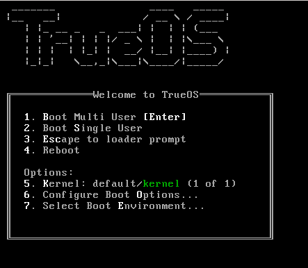

   : |trueos| Boot Menu

Boot into another boot environment at startup by pressing :kbd:`7` at
the :ref:`TrueOS Boot Menu <install1(1)>` to access the boot menu
selection screen. In the example shown in :numref:`Figure %s <be2>`, two
boot environments are available in :guilabel:`Boot Environments`:
*initial* represents the initial installation and *mybootenvironment*
was manually created using the Boot Environment Manager.

.. _be2:

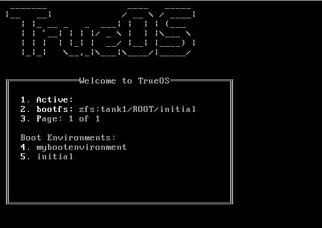

   : Boot Environments Menu

The upper section of this menu indicates the *initial* boot environment
is set to **active**, or the one the system is configured to boot into,
unless another BE is manually selected in this menu. Use the arrow keys
to highlight the desired boot environment and press :kbd:`Enter` to
continue booting into the selected boot environment.

.. index:: sysadm, configuration
.. _Firewall Manager:

Firewall Manager
================

The Firewall Manager is a simple interface used to configure ports and
firewalls. In :numref:`Figure %s <firewall1>`, the Multicast DNS service
is active and using port 5353 is open, with the firewall started.

.. _firewall1:

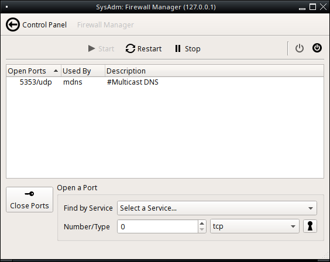

   : |sysadm| Firewall Manager

The top row of the interface has options to configure the firewall.
:guilabel:`Start` turns on the firewall, :guilabel:`Restart` will turn
the firewall off and on again, and :guilabel:`Stop` turns the firewall
off. On the right side of the row are two buttons, :guilabel:`Power On`
and :guilabel:`Power Off`. 

.. note:: In :numref:`Figure %s <firewall1>`, the :guilabel:`Start`
   option is greyed out, as the firewall is currently active. Additionally,
   :guilabel:`Power On` is also greyed out as the firewall is configured
   to start on bootup.

The central window describes all added services. The list can be sorted
by clicking :guilabel:`Open Ports`. Next, the :guilabel:`Used By` column
displays the name of the service using the open ports. Finally, the
:guilabel:`Description` column offers more information about the service
name in the same row.

The bottom portion of the interface provides options to open and close
ports. There are two options to open a port: :guilabel:`Find by Service`
and :guilabel:`Number/Type`:

**Find by Service:** Click :guilabel:`Select a Service...` to
open a drop down menu of alphabetized services. Click the desired
service, and the Firewall Manager will automatically add it to the list
of open ports.

.. tip:: The services list can be navigated quickly by typing the name
   of the desired service while the list is open.

**Number/Type:** Manually designate a port to open by typing the number
in the :guilabel:`Number` field. The :guilabel:`Arrow` icons can be
pressed to either increase or decrease the number by one. The next drop
down menu allows for designating between **tcp** or **udp**. Once the
number and type of port are chosen, click the :guilabel:`Keyhole` icon
to confirm the selections and open the desired port.

To close a port, select a port from the :guilabel:`Open Ports`
column and press :guilabel:`Close Ports`.

.. index:: sysadm, configuration
.. _Service Manager:

Service Manager
===============

The Service Manager offers a view of all the system's installed
services, as seen in :numref:`Figure %s <service1>`. There are also
several options to configure these services.

.. _service1:

.. figure:: images/service1.png
   :scale: 100%

   : |sysadm| Service Manager

Services are listed in a chart with four columns:

* **Name:** The name of the service. All services are listed
  alphabetically by name.

* **Running:** Indicates if the service is active. "True" means the
  service is running, "false" means it is not.

* **Start on Boot:** Shows with "true" or "false" if the service will be
  automatically activated when the system is initialized.

* **Description:** If available, displays text describing the server.

Underneath the chart is a row with multiple buttons:

* **Play Icon:** Starts the selected service.

* **Pause Icon:** Stops the selected service.

* **Reload Icon:** Restarts the selected service.

* **Power On Icon:** Enables the service to automatically start on boot.

* **Power Off Icon:** Disables the service from starting on boot.

Hovering over any of these icons will display a helpful description
across the bottom of the window.

.. index:: sysadm, configuration
.. _Task Manager:

Task Manager
============

Task Manager provides a graphical view of memory use, per-CPU use and
a listing of currently running applications. An example is shown in
:numref:`Figure %s <task1>`.

.. _task1:

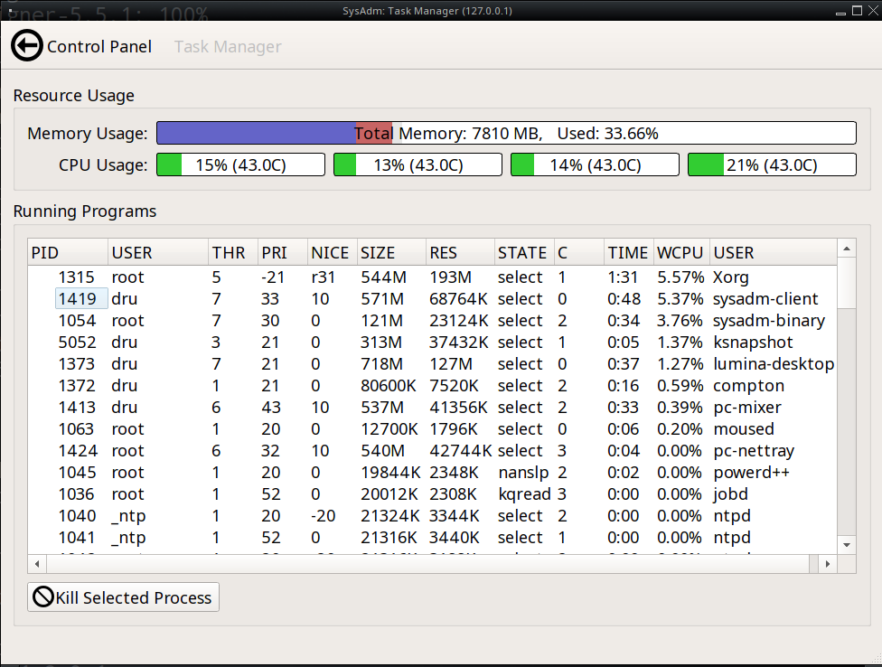

   : |sysadm| Task Manager

The "Running Programs:" section provides a graphical front-end to
`top(1) <https://www.freebsd.org/cgi/man.cgi?query=top>`_.

The :guilabel:`Kill Selected Process` button can be used to terminate
the selected process.

.. index:: configuration
.. _User Manager:

User Manager
============

The |trueos| User Manager utility allows you to easily add, configure,
and delete users and groups. To access this utility in |sysadm|, click
:menuselection:`System Management --> User Manager`.

In the example shown in :numref:`Figure %s <user1>`, the system has one
user account that was created in the "Create a User" screen during
installation.

.. _user1:

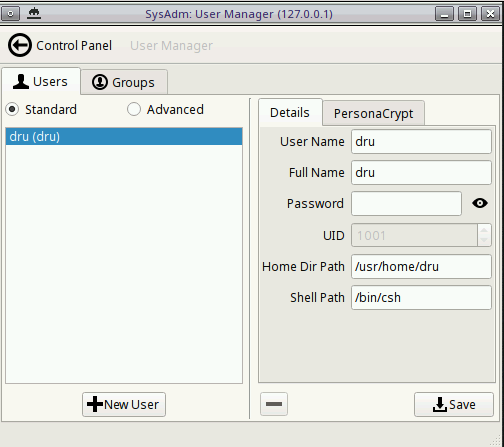

   : Viewing User Accounts in User Manager

The :guilabel:`Standard` view allows you to configure the following:

* **User Name:** The name the user will use when they log in to the
  system. It is case sensitive and can not contain any spaces.

* **Full Name:** This field provides a description of the account and
  can contain spaces.

* **Password:** This is where you can change the password for the
  user. The password is case-sensitive and can contain symbols. If you
  want to display the password as you change it, click the
  :guilabel:`eye` icon. Click the icon again to show dots in place of
  the actual password.

* **UID:** This value is greyed out as it is assigned by the operating
  system and cannot be changed after the user is created.

* **Home Dir Path:** If you change the user's home directory, input the
  full path.

* **Shell Path:** If you change the user's default shell, input the
  full path to an installed shell. The paths for each installed shell
  can be found in :file:`/etc/shells`.

If you make any changes to a user's "Details", click the
:guilabel:`Save` button to save them.

:numref:`Figure %s <user2>` demonstrates how this screen changes when
clicking :guilabel:`New User`.

.. _user2:

.. figure:: images/user2.png
   :scale: 100%

   : Creating a New User Account

Fields outlined in red are required when creating a user. The
:guilabel:`User Name`, :guilabel:`Full Name`, and :guilabel:`Password`
fields are the same as described in the :guilabel:`Details` tab. There
are several more available fields:

**UID:** By default, the user will be assigned the next available User
ID (UID). If you need to force a specific UID, uncheck the
:guilabel:`Auto` box and either input or select the number to use. Note
you cannot use an UID already in use by another account and those
numbers will appear as red.

**Home Dir Path:** By default, this is set to :file:`/nonexistent`
which is the correct setting for a system account as it prevents
unauthorized logins. If you are creating a user account for login
purposes, input the full path to use for the user's home directory.

**Shell:** By default, this is set to :file:`/usr/bin/nologin`, which
is the correct setting for a system account as it prevents
unauthorized logins. If you are creating a user account for login
purposes, input the full path of an installed shell. The paths for
each installed shell can be found in :file:`/etc/shells`.

**Adminstrator Access:** Check this box if the user requires
`su(1) <https://www.freebsd.org/cgi/man.cgi?query=su>`_ access. Note
this setting requires the user to know the password of the *root* user.

**Operator Access:** Check this box if the user requires :command:`sudo`
access. This allows the user to precede an administrative command with
:command:`sudo` and be prompted for their own password.

Once you have made your selections, press :guilabel:`Save` to create the
account.

If you click :guilabel:`-` (remove) for a highlighted user, a pop-up
menu will ask if you are sure you want to remove the user and a second
pop-up will ask if you would also like to delete the user's home
directory (along with all of their files). If you click :guilabel:`No`
to the second pop-up, the user will still be deleted, but their home
directory will remain. Note :guilabel:`-` will be greyed out if you
highlight the user that started |sysadm|. It will also be greyed out if
there is only one user account, as you need at least one user to login
to the |trueos| system.

Click :guilabel:`Advanced View` to show all of the accounts on the
system, not just the user accounts you created. An example is seen in
:numref:`Figure %s <user3>`.

.. _user3:

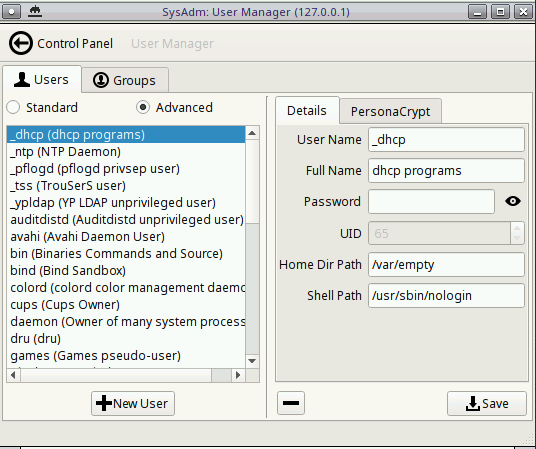

   : Viewing All Accounts and Their Details

The accounts you did not create are known as system accounts and are
needed by the operating system or installed applications. Do **not**
delete any accounts you did not create yourself as doing so may cause a
previously working application to stop working.
:guilabel:`Advanced View` provides additional information associated
with each account, such as the user ID number, full name (description),
home directory, default shell, and primary group. System accounts
usually have a shell of *nologin* for security reasons, indicating an
attacker can not login to the system using that account name.

.. index:: users, personacrypt
.. _PersonaCrypt:

PersonaCrypt
------------

|trueos| provides support for a security feature known as PersonaCrypt.
A PersonaCrypt device is a removable USB media, such as a USB flash
drive, formatted with ZFS and encrypted with either GELI or PEFS. This
device is used to hold a specific user's home directory, meaning they
can securely transport and access their personal files on any |trueos|
or |pcbsd| 10.1.2 or higher system. For example, this can be used to
securely access one's home directory from a laptop, home computer, and
work computer. The device is protected by an encryption key and a
different (recommended) password separate from the user's login
password.

.. note:: When a user is configured to use a PersonaCrypt device, that
   user can not login using an unencrypted session on the same system.
   In other words, the PersonaCrypt username is reserved for
   PersonaCrypt use. If you need to login to both encrypted and
   unencrypted sessions on the same system, create two different user
   accounts, one for each type of session.

.. index:: users, personacrypt, geli
.. _GELI:

GELI
^^^^

PersonaCrypt uses GELI's ability to split the key into two parts: one
being your passphrase, and the other being a key stored on disk.
Without both of these parts, the media cannot be decrypted. This means
if somebody steals the key and manages to get your password, it is still
worthless without the system it was paired with. GELI is used by default
in |trueos| as it is more fully featured over PEFS.

.. warning:: USB devices do eventually fail. Always backup any important
   files stored on the PersonaCrypt device to another device or system. 

The :guilabel:`PersonaCrypt` tab can be used to initialize a
PersonaCrypt device for any login user, **except** for the currently
logged in user. In the example shown in
:numref:`Figure %s <user5>`, a new user, named *dlavigne*, has been
created and the entry for the user has been clicked.

.. _user5: 

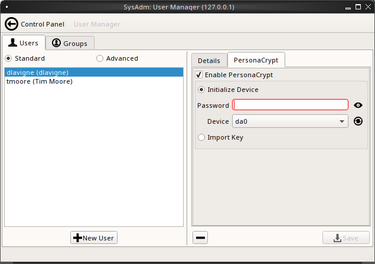

   : Initialize PersonaCrypt Device

Before a user is configured to use PersonaCrypt on a |trueos| system,
two buttons are available in the :guilabel:`PersonaCrypt` tab of
:guilabel:`Advanced Mode`. Note this section is hidden if the currently
logged in user is selected. Also, if you have just created a user and do
not see these options, click :guilabel:`Save`, then re-highlight the
user to display these options:

* **Initialize Device:** Used to prepare the USB device which will be
  used as the user's home directory.

* **Import Key:** If the user has already created a PersonaCrypt device
  on another |trueos| system, click this button to import a previously
  saved copy of the key associated with the device. Once the key is
  imported, the user can now login to this computer using PersonaCrypt.

To prepare a PersonaCrypt device for this user, insert a USB stick and
click :guilabel:`Initialize Device`.

.. warning:: Since the USB stick will hold the user's home directory and
   files, ensure the stick is large enough to meet the anticipated
   storage needs of the home directory. Since the stick will be
   reformatted during the initialization process, make sure any current
   data on the stick you need has been copied elsewhere. Also, the
   faster the stick, the better the user experience while logged in.

Type a password to associate with the device. Click :guilabel:`Save` to
initialize the device. The User Manager may take a moment to prepare the
device. Once initialization is complete, the User Manager screen
will change to allow removal of PersonaCrypt.

Once a user has been initialized for PersonaCrypt on the system, their
user account will no longer be displayed when logging in, **unless**
their PersonaCrypt device is inserted. Once the USB device is inserted,
the login screen will add an extra field, as seen in the example shown
in :numref:`Figure %s <troslogin5>`.

.. _troslogin5:

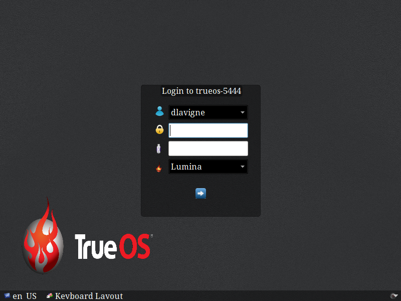

   : |trueos| Login Screen with PersonaCrypt

.. note:: When stealth sessions have been configured, PersonaCrypt
   users will still be displayed in the login menu, even if their USB
   device is not inserted. This is to allow those users the option to
   instead login using a stealth session.

In the field with the yellow padlock icon, input the password for the
user account. In the field with the grey USB stick icon, input the
password associated with the PersonaCrypt device.

.. warning:: To prevent data corruption and freezing the system
   **DO NOT** remove the PersonaCrypt device while logged in! Always log
   out of your session before physically removing the device.

.. index:: users, personacrypt, pefs
.. _PEFS Encryption:

PEFS
^^^^

`PEFS <http://pefs.io/>`_ stands for Private Encrypted File System. It
is open source software freely available under the BSD license, and is
included in |trueos| by default. PEFS runs on top of any existing file
system, providing an encryption layer independent of the underlying file
system. PersonaCrypt can be configured to use PEFS in place of GELI,
which eliminates the need for external media, as the encrypted PEFS
database is stored on the local disk.

.. warning:: While PEFS does not use a USB drive, be sure to print or
   otherwise backup the PEFS generated key fragment stored on the disk.

**Initialize PEFS with the Command Line**

Because PEFS does not use a USB drive with its encryption, the user will
need a password file (pfile) containing the desired password, **before**
initializing PEFS for a user account. Once this pfile is created,
enabling PEFS through PersonaCrypt is accomplished in a CLI with
:command:`personacrypt init <username> <pfile> PEFS`.

For example, the user account **test** has a pfile named
:file:`testpfile.txt`, which contains the single text string of **test's**
chosen password. Next, the administrator adds PEFS encryption to the
**test** acount by opening a CLI, logging in as root, and typing:

.. code-block:: none

 # personacrypt init test testpfile.txt PEFS

PersonaCrypt will initialize the account **test** with PEFS, using the
string in :file:`testpfile.txt` as the new password.

The |sysadm| User Manager can also initialize a user account with PEFS
by choosing :guilabel:`on-disk encryption (PEFS)` in the
:guilabel:`Device` drop down menu of the :guilabel:`PersonaCrypt` tab.

In addition to initializing an account with PEFS, PersonaCrypt also
supports importing and exporting PEFS on-disk keyfiles with
:command:`personacrypt export <username>` and
:command:`personacrypt import <keyfile>`, respectively.

.. index:: users
.. _Managing Groups:

Managing Groups
---------------

Click the :guilabel:`Groups` tab to view and manage the groups on the
system. The :guilabel:`Standard` tab, seen in
:numref:`Figure %s <user4>`, shows the group membership for the
*operator* and *wheel* groups:

.. _user4:

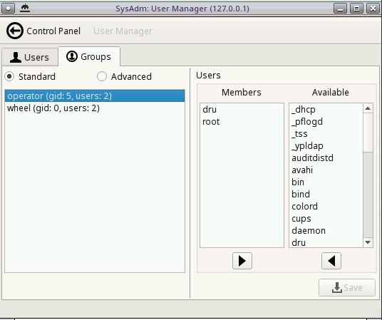

   : Managing Groups Using User Manager

This screen has 2 columns:

**Members:** Indicates if the highlighted group contains any user
accounts.

**Available:** Shows all of the system and user accounts on the system
in alphabetical order.

To add an account to a group, highlight the group name, then highlight
the account name in the :guilabel:`Available` column. Click the left
arrow and the selected account will appear in the :guilabel:`Members`
column. You should only add user accounts to groups you create yourself
or when an application's installation instructions indicate an account
needs to be added to a group.

.. note:: If you add a user to the *operator* group, they will have
   permission to use commands requiring administrative access and will
   be prompted for their own password when administrative access is
   required. If you add a user to the *wheel* group, they will be
   granted access to the :command:`su` command and will be prompted
   for the superuser password whenever they use the command.

To view all of the groups on the system, click :guilabel:`Advanced`.

.. index:: sysadm, life preserver
.. _Life Preserver:

Life Preserver
==============

The Life Preserver utility is designed to take full advantage of the
functionality provided by ZFS snapshots. This utility allows you to
schedule snapshots of a ZFS pool and to optionally replicate those
snapshots to another system over an encrypted connection. This design
provides several benefits:

* A snapshot provides a "point-in-time" image of the ZFS pool. This
  is similar to a full system backup as the snapshot contains the
  information for the entire filesystem. However, it has several
  advantages over a full backup. Snapshots occur instantaneously,
  meaning the filesystem does not need to be unmounted and you can
  continue to use applications on your system as the snapshot is
  created. Since snapshots contain the meta-data ZFS uses to access
  files, the snapshots themselves are small and subsequent snapshots
  only contain the changes that occurred since the last snapshot was
  taken. This space efficiency means you can take snapshots often.
  Snapshots also provide a convenient way to access previous versions of
  files as you can browse to the point-in-time for the version of the
  file you need. Life Preserver makes it easy to configure when
  snapshots are taken and provides a built-in graphical browser for
  finding and restoring the files within a snapshot.

* Replication is an efficient way to keep the files on two systems in
  sync. With Life Preserver, the snapshots taken on the |trueos| system
  will be synchronized with their versions stored on the specified
  backup server.

* Snapshots are sent to the backup server over an encrypted connection.

* Having a copy of the snapshots on another system makes it possible to
  perform an operating system restore should the |trueos| system become
  unusable or to deploy an identical system to different hardware.

To manage snapshots and replication using the |sysadm| graphical client,
go to :menuselection:`Utilities --> Life Preserver`. The rest of this
section describes where to find and how to use the features built into
Life Preserver.

.. index:: snapshots, life preserver
.. _Snapshots Tab:

Snapshots Tab
-------------

:numref:`Figure %s <lpreserver1>` shows the :guilabel:`Snapshots` tab on
a system not yet configured. This system has a "ZFS Pool" named "tank1".

.. _lpreserver1:

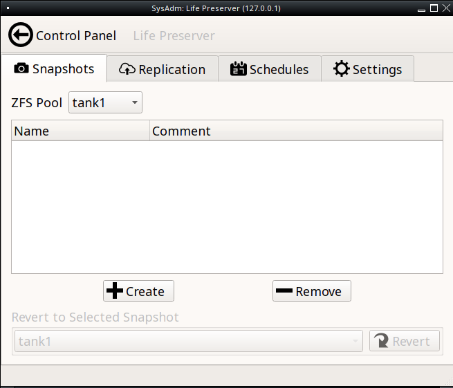

   : Snapshot Tab

This screen will display any created snapshots and provides buttons to:

**Create:** Used to create a manual snapshot of the specified pool
now. For example, you could create a snapshot before making changes to
an important file, so you can preserve a copy of the previous version of
the file. Or, you can create a snapshot as you make modifications to the
system configuration. When creating a snapshot, a pop-up message will
prompt you to input a name for the snapshot, allowing you to choose a
name that is useful in helping you remember why you took the snapshot.
An entry will be added to this screen for the snapshot where the
:guilabel:`Name` will be the name you input and the :guilabel:`Comment`
will inidcate the date and time the snapshot was created.

**Remove:** Used to delete a highlighted snapshot.
**This is a permanent change that can not be reversed.** In other
words, the versions of files at the point in time the snapshot was
created will be lost.

**Revert:** If you highlight a snapshot entry, this button and the
drop-down menu next to it will activate. You can use the drop-down
menu to specify which pool or dataset you would like to revert.
**Be aware that a revert will overwrite the current contents of the
selected pool or dataset to the point in time the snapshot was created.**
This means files changes occurring after the snapshot was taken will be
lost.

.. index:: replication, life preserver
.. _Replication Tab:

Replication Tab
---------------

Life Preserver can be configured to replicate snapshots to another
system over an encrypted SSH connection, though the backup itself is
stored in an unencrypted format. This ensures you have a backup copy of
your snapshots on another system.

In order to configure replication, the remote system to hold a copy of
the snapshots must first meet several requirements:

* Snapshots occurring too frequently can introduce errors in
  replication. To avoid errors, ensure snapshots are configured to take
  place slower than the desired pace of replication.

* The backup server
  **must be formatted with the latest version of ZFS,** also known as
  ZFS feature flags or ZFSv5000. Operating systems that support this
  version of ZFS include |trueos|, FreeBSD or |pcbsd| 9.2 or higher,
  and FreeNAS 9.1.x or higher.

* The system must have SSH installed and the SSH service must be
  running. If the backup server is running |trueos|, |pcbsd|, |freenas|
  or FreeBSD, SSH is already installed, but you will need to start the
  SSH service.

* If the backup server is running |trueos| or |pcbsd|, you will need to
  open TCP port 22 (SSH) using the :guilabel:`Firewall Manager`. If the
  server is running FreeBSD and a firewall has been configured, add a
  rule to open this port in the firewall ruleset. |freenas| does not run
  a firewall by default. Also, if there is a network firewall between
  the |trueos| system and the backup system, make sure it has a rule to
  allow SSH.

:numref:`Figure %s <lpreserver2>` shows the initial
:guilabel:`Replication` tab on a system that has not yet been configured
for replication. This screen is used to create, view, remove, and
configure the replication schedule.

.. _lpreserver2:

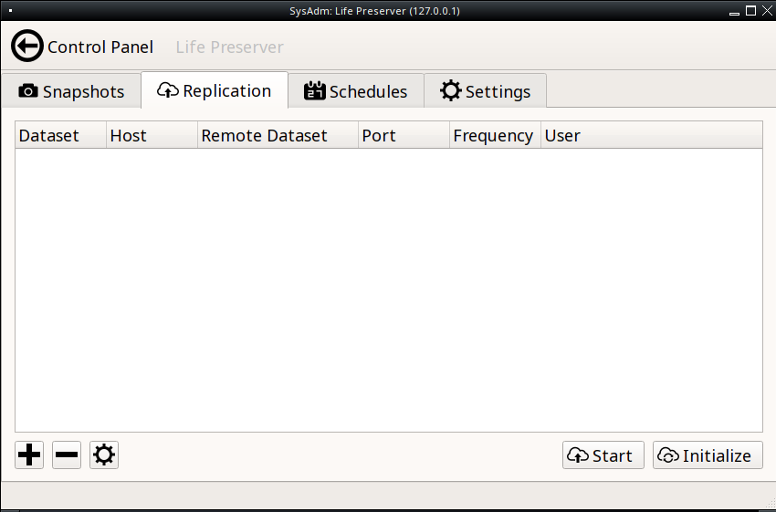

   : Replication Tab

To schedule the replication, click :guilabel:`+` to display the
"Setup Replication" screen shown in
:numref:`Figure %s <lpreserver3>`.

.. _lpreserver3:

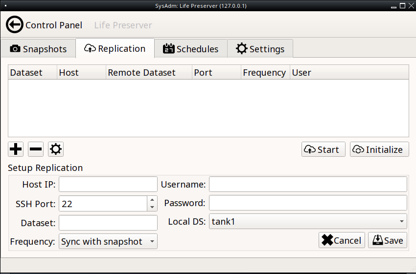

   : Scheduling a Replication

Input the following information:

* **Host IP:** The IP address of the remote system to store the
  replicated snapshots.

* **SSH Port:** The port number, if the remote system is running SSH
  on a port other than the default of 22.

* **Dataset:** The name of the ZFS pool and optional dataset on the
  remote system. For example, "remotetank" will save the snapshots to
  a ZFS pool of that name and "remotetank/mybackups" will save the
  snapshots to an existing dataset named "mybackups" on the pool named
  "remotetank".

* **Frequency:** Use the drop-down menu to select how often to
  initiate the replication. Available choices are
  :guilabel:`Sync with snapshot` (at the same time a snapshot is
  created), :guilabel:`Daily` (when selected, displays a time drop-down
  menu so you can select the time of day), :guilabel:`Hourly`, every
  :guilabel:`30 minutes`, every :guilabel:`10 minutes`, or
  :guilabel:`Manual Only` (only occurs when you click :guilabel:`Start`)
  in this screen.

* **Username:** The username must already exist on the remote system,
  have write access to the specified "Dataset", and have permission to
  SSH into that system.

* **Password:** The password associated with the "Username".

* **Local DS:** Use the drop-down menu to select the pool or dataset
  to replicate to the remote system.

The buttons at the top of the "Setup Replication" screen have several
uses:

* **+ icon:** Sdd a replication schedule. Multiple schedules are
  supported, meaning you can replicate to multiple systems or replicate
  different "Local DS" datasets at different times.

* **- icon:** Remove an already created, and highlighted, replication
  schedule.

* **gear icon:** Modify the schedule for the highlighted replication.

* **Start:** Manually starts a replication to the system specified in
  the highlighted replication.

* **Initialize:** Deletes the existing replicated snapshots on the
  remote system and starts a new replication. This is useful if a
  replication gets stuck and will not complete.

.. index:: configuration, life preserver
.. _Schedules Tab:

Schedules Tab
-------------

This tab is used to manage when snapshots of the ZFS pool are created.
Multiple snapshot schedules are supported if the system has multiple
pools.

.. note:: Snapshots are created on the entire pool as they are needed
   when :ref:`Restoring the Operating System`.

To create a snapshot schedule, click the :guilabel:`camera` icon in the
lower left corner of this tab. This will activate the "Setup Snapshot
Schedule" pane as seen in :numref:`Figure %s <lpreserver4>`.

.. _lpreserver4:

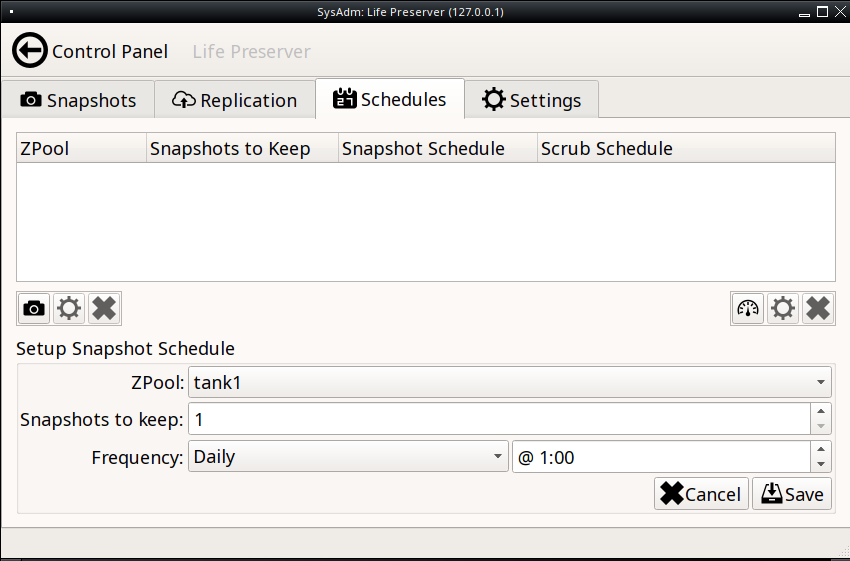

   : Scheduling a Snapshot

This pane contains several options:

**Storage Pool:** Select the ZFS storage pool that contains the datasets
that you wish to snapshot.

**Snapshots to keep:** Snapshots are automatically pruned after the
specified number of snapshots to prevent snapshots from eventually
using up all of your disk space. If you would like to have multiple
versions of files to choose from, select the number of snapshots to
keep. Note auto-pruning only occurs on the snapshots generated by
Life Preserver according to the configured schedule. Auto-pruning will
not delete any snapshots you create manually in the
:guilabel:`Snapshots` tab.

**Frequency:** Use the drop-down menu to select how often snapshots
occur. Options include "Daily" (which will allow you to select the time
of day), "Hourly" every "30 Minutes", every "10 Minutes", or every "5
Minutes".

Once you have created a snapshot schedule, you can use the "gear" icon
next to the "camera" icon to modify the highlighted schedule or the
"X" icon to delete the highlighted schedule.

This screen can also be used to manage the ZFS scrub schedule. Scrubs
are recommended as they can provide an early indication of a potential
disk failure. Scrubs can be scheduled on a per-pool basis. 

.. tip:: If you have multiple pools, be sure to create a scrub schedule
   for each pool.

To schedule when the scrub occurs, click the third icon from the right
which will activate the "Setup Scrub Schedule" screen shown in
:numref:`Figure %s <lpreserver5>`.

.. _lpreserver5:

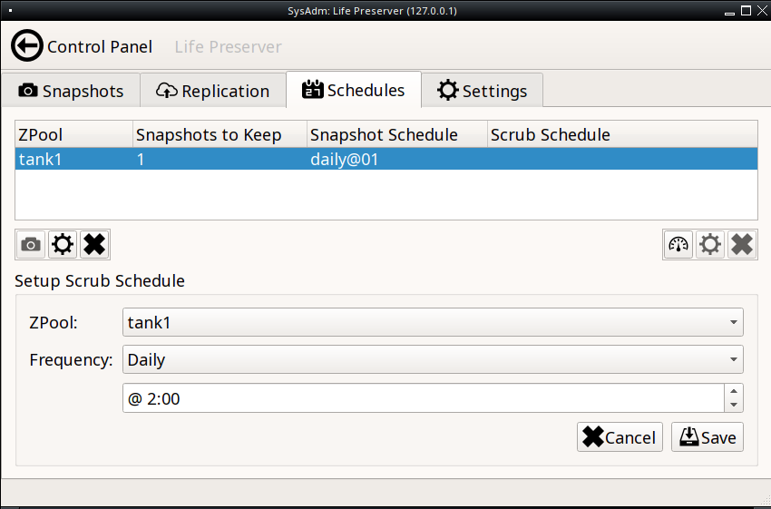

   : Scheduling a Scrub

Select the pool from the :guilabel:`Storage Pool` drop-down menu, then
select the :guilabel:`Frequency`. Supported frequencies are "Daily",
"Weekly", or "Monthly". If you select "Daily", you can configure the
"Hour". If you select "Weekly", you can configure the "Day of week" and
the "Hour".  If you select "Monthly", you can configure the "Date" and
"Hour". Since a scrub can be disk I/O intensive, it is recommended to
pick a time when the system will not be in heavy use.

Once you have created a scrub schedule, you can use the "gear" icon
next to the "schedule scrub" icon to modify the highlighted schedule or
the "X" icon to delete the highlighted schedule.

.. index:: configuration, life preserver
.. _Settings Tab:

Settings Tab
-------------

The :guilabel:`Settings` tab is shown in
:numref:`Figure %s <lpreserver6>`.

.. _lpreserver6:

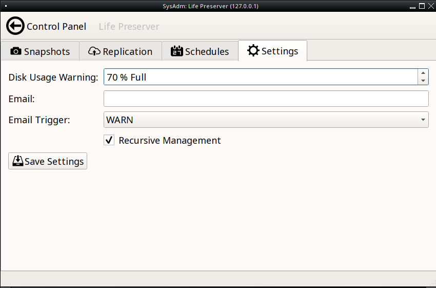

   : Life Preserver Settings

Many settings are configurable:

**Disk Usage Warning:** Enter a number up to 99 to indicate at which
percentage of disk space Life Preserver will display an alert in the
system tray. This is useful to prevent snapshots from using up all
available disk space.

**Email:** To receive an email when disk usage reaches the percentage
configured in the "Disk Usage Warning", enter an email address.

**Email Trigger:** This setting can be set to "All", "Warn", or "Error"
and indicates the type of condition which will trigger an email message.

**Recursive Management:**

If you make any changes in this screen, press :guilabel:`Save Settings`
to apply them.

.. index:: backup
.. _Using the lpreserver CLI:

Using the lpreserver CLI
------------------------

The :command:`lpreserver` command line utility can also be used to
manage snapshots and replication. This command needs to be run as the
superuser. To display its usage, type the command without any arguments:

.. code-block:: none

 lpreserver
 Life-Preserver
 ---------------------------------
 Available commands
 Type in help <command> for information and usage about that command
       help - This help file or the help for the specified command
   cronsnap - Manage scheduled snapshots
  cronscrub - Manage scheduled scrubs
   snapshot - Manage snapshot tasks
  replicate - Manage replication tasks
        set - Set lpreserver options
        get - Get list of lpreserver options
     status - List datasets, along with last snapshot / replication date

Each command has its own help text that describes its parameters and
provides a usage example. For example, to receive help on how to use
the :command:`lpreserver cronsnap` command, type:

.. code-block:: none

 lpreserver help cronsnap
 Life-Preserver
 ---------------------------------
 Help cronsnap
 Schedule a ZFS snapshot
 Usage:
  lpreserver cronsnap <subcommand> <options>
 Available subcommands:
        start - Schedule snapshots for a dataset
         stop - Stop scheduled snapshots for a dataset.
         list - List scheduled snapshots
      exclude - Exclude datasets for scheduled snapshots
    rmexclude - Remove datasets from exclude list for scheduled snapshots
  listexclude - List excluded datasets for scheduled snapshots
 start options:
  start <dataset> <frequency> <numToKeep>
  frequency = auto / daily@XX / hourly / 30min / 10min / 5min
                                ^^ Hour to execute
  numToKeep = Number of snapshots to keep total
 NOTE: When frequency is set to auto the following will take place:
  * Snapshots will be created every 5 minutes and kept for an hour.
  * A hourly snapshot will be kept for a day.
  * A daily snapshot will be kept for a month.
  * A Monthly snapshot will be kept for a year.
  * The life-preserver daemon will also keep track of the storage pool disk space.
    If the capacity falls below 75%, the oldest snapshot will be auto-pruned.
 Examples:
  lpreserver cronsnap start tank1/usr/home/kris daily@22 10
  Schedule snapshots of dataset tank1/usr/home/kris daily at 22:00.
  10 snapshots will be kept.
 stop options:
  stop <dataset>
 list options:
  list <dataset>
  List all snapshot schedules for a dataset.
  If no dataset is given it will list schedules for all datasets.
 exclude options:
  exclude <dataset> <exclude dataset> <exclude dataset> ...
  Exclude one or more datasets from scheduled snapshots.
 Examples:
  lpreserver cronsnap exclude tank1/usr/home/kris tank1/usr/home/kris/tmp tank1/usr/home/kris/test
  Exclude dataset tank1/usr/home/kris/tmp and tank1/usr/home/kris/test from scheduled snapshots
  on dataset tank1/usr/home/kris.
 rmexclude options:
  rmexclude <dataset> <excluded dataset> <excluded dataset> ...
  Remove exclude for one or more datasets that was previously excluded from scheduled snapshots.
  This removes the datasets from the exclude list.
 Examples:
  lpreserver cronsnap rmexclude tank1/usr/home/kris tank1/usr/home/kris/tmp tank1/usr/home/kris/test
  Dataset tank1/usr/home/kris/tmp and tank1/usr/home/kris/test on dataset tank1/usr/home/kris
  are no longer excluded for scheduled snapshots.
 listexclude options:
  listexclude <dataset>
  List which datasets are excluded from schedule snapshots.

:numref:`Table %s <cmdgui>` shows the command line equivalents to the
graphical options provided by the Life Preserver GUI.

.. _cmdgui:

.. table:: : Command Line and GUI Equivalents

   +--------------+-------------+------------------------------------+
   | Command Line | GUI Tab     | Description                        |
   +==============+=============+====================================+
   | cronsnap     | Snapshots   | Schedule when snapshots occur      |
   |              |             | and how long to keep them; the     |
   |              |             | **stop** option can be used to     |
   |              |             | disable snapshot creation          |
   +--------------+-------------+------------------------------------+
   | cronscrub    | Schedules   | Schedule a ZFS scrub               |
   +--------------+-------------+------------------------------------+
   | get          | Settings    | List Life Preserver options        |
   +--------------+-------------+------------------------------------+
   | replicate    | Replication | Used to list, add, and remove      |
   |              |             | backup server; read the **help**   |
   |              |             | for this command for examples      |
   |              |             |                                    |
   +--------------+-------------+------------------------------------+
   | set          | Settings    | Configures Life Preserver options; |
   |              |             | read **help** for the list of      |
   |              |             | configurable options               |
   +--------------+-------------+------------------------------------+
   | snapshot     | Snapshots   | Create and replicate a new ZFS     |
   |              |             | snapshot; by default, snapshots    |
   |              |             | are recursive, meaning that a      |
   |              |             | that a snapshot is taken of every  |
   |              |             | dataset within a pool              |
   +--------------+-------------+------------------------------------+
   | status       |             | Lists the last snapshot name and   |
   |              |             | replication status                 |
   +--------------+-------------+------------------------------------+

.. _Restoring the Operating System:

Restoring the Operating System
------------------------------

If you have replicated the system's snapshots to a remote backup
server, you can use a |trueos| installation media to perform an
operating system restore or to clone another system. Start the
installation as usual until you get to the screen shown in
:numref:`Figure %s <restore1>`.

.. _restore1:

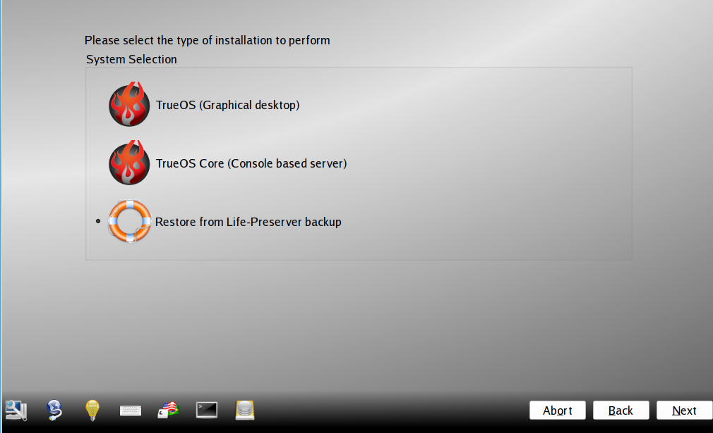

   : Selecting to Restore/Clone From Backup

Before you can perform a restore, the network interface must be
configured. Click :guilabel:`Network Connectivity` (second icon from the
left) in order to determine if the network connection was automatically
detected. If not, refer to the instructions in the
`Network Manager <https://www.trueos.org/handbook/using.html#network-manager>`_
section of the |trueos| handbook and make sure that networking is
working before continuing.

Once you are ready, click :guilabel:`Restore from Life-Preserver backup`
and :guilabel:`Next`. This will start the Restore Wizard. In the screen
shown in
:numref:`Figure %s <restore2>`,
input the IP address of the backup server and the name of the user
account used to replicate the snapshots. If the server is listening on
a non-standard SSH port, change the "SSH port" number.

.. _restore2:

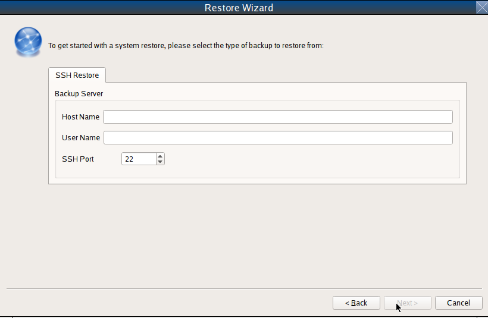

   : Input the Information for a SSH Restore

Click :guilabel:`Next` and the wizard will provide a summary of your
selections. If correct, click :guilabel:`Finish`; otherwise, click
:guilabel:`Back` to correct them.

Once the connection to the backup server succeeds, you will be able to
select which host to restore. After making your selection, click
:guilabel:`Next`. The restore wizard will provide a summary of which
host it will restore from, the name of the user account associated with
the replication, and the hostname of the target system. Click
:guilabel:`Finish` and the installer will proceed to the
`Disk Selection Screen <https://www.trueos.org/handbook/install.html#disk-selection-screen>`_.
At this point, you can click the :guilabel:`Customize` button to
customize the disk options. However, in the screen shown in Figure 3.3h,
the ZFS datasets will be greyed out as they will be recreated from the
backup during the restore. Once you are finished with any
customizations, click :guilabel:`Next` to perform the restore.
